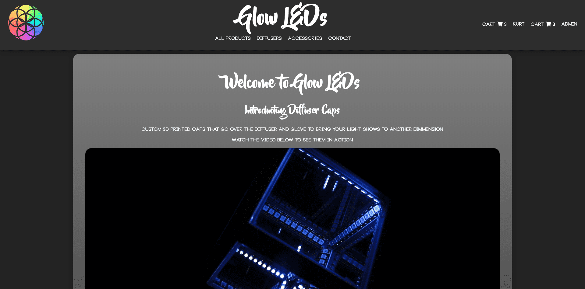
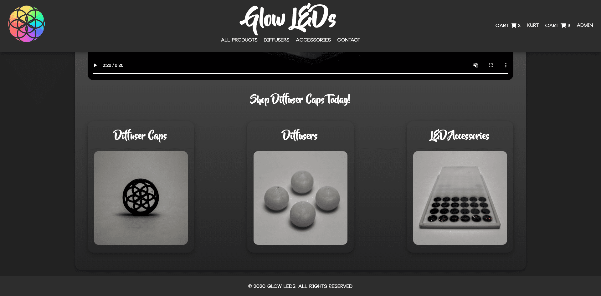
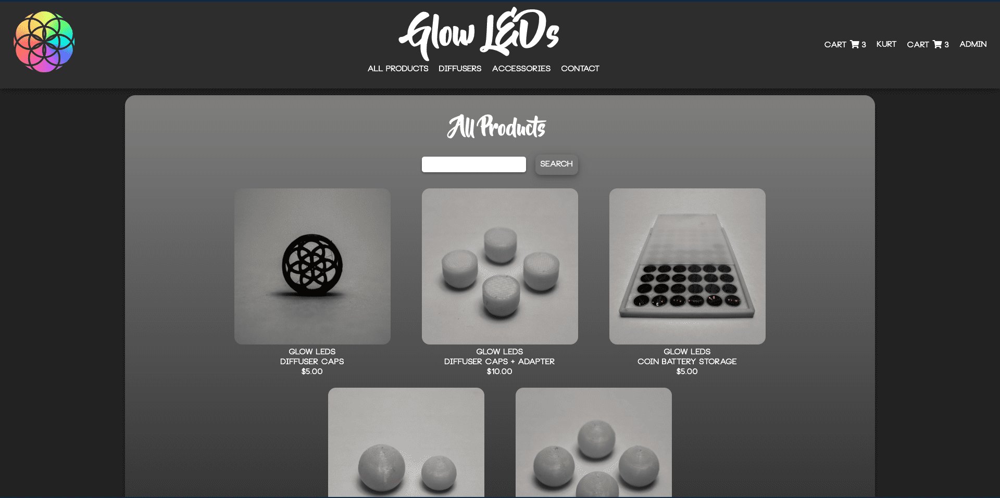
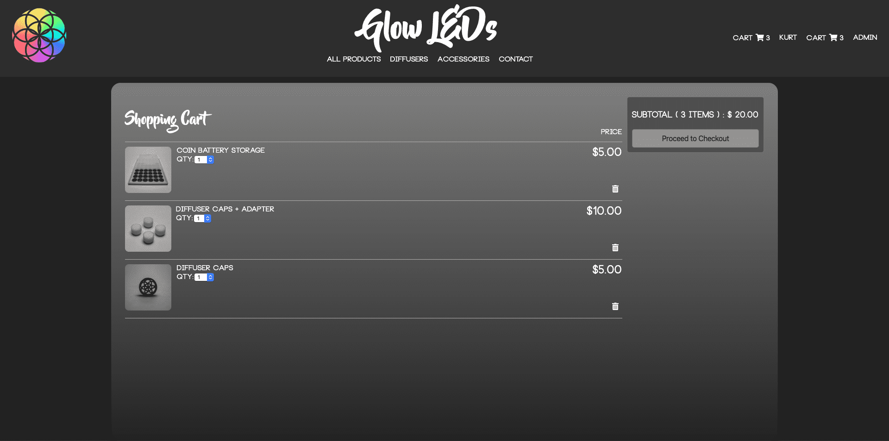
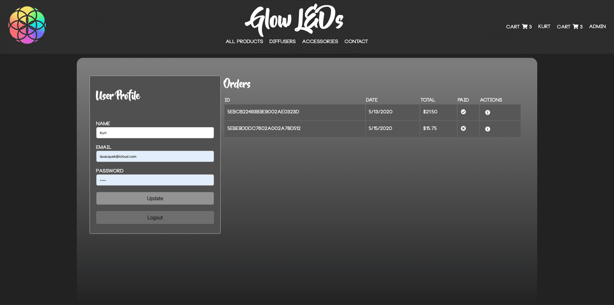
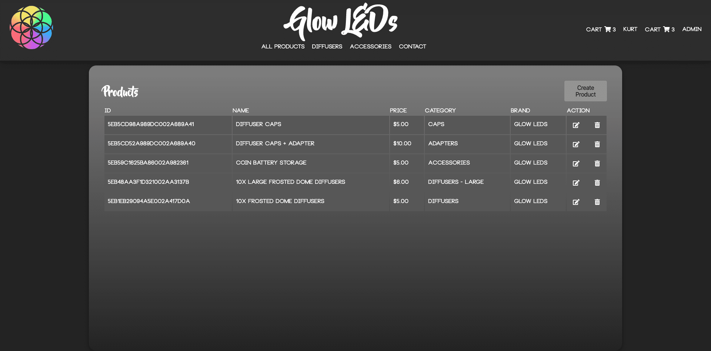
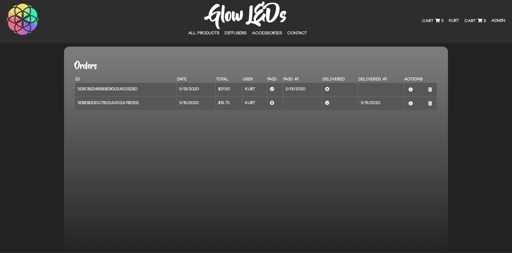

# GlowLEDs

<p align="center">
  
  <h1 style="text-align: center;">3D Printed LED toys, by a glover that wants the world to stay lit</h1>
  <!-- <h1 style="text-align: center;">3D Printed LED toys and accessories, by a glover that just wants to light up the world</h1> -->
</p>


# Inspiration

I have been facinated with LEDs ever since I saw my first light show back in early 2014, and always wanted the top of the line gloves so that I could customize the modes as much as possible. I've noticed that led diffusers have not made any significant advancements and feel little bored with what is avaiable. So then I bought my Prusa i3 MK3s 3D printer, and got to work developing what I call _______ (To Be Announced)!

# Features

### Admin
- Add a Product
- Edit a Product
- Delete a Product
- View Orders
- Mark Orders and Shipped and Delivered
### User
- Create an Account
- View Products
- View Cart
- Add Item to Cart
- Adjust the quantity of the product
- Remove Item from Cart
- Pay with Paypal
- View Orders
- Recieve Email Notifications based on order and account status
- Account Verification via Email Link
- Forgot your Password Flow


# Installation

First clone this repo

```shell
git clone git@github.com:livingkurt/Glow-LEDs.git
```

Install Dependancies

```shell
npm install
```

## .env Set Up

Copy .env example and name it .env

#### MONGODB_URI

Local Mongodb URI

#### ACCESS_TOKEN_SECRET

Create secret key that is unsed to create your jwt tokens

#### PAYPAL_CLIENT_ID

Set up your paypal developer account and paste in your client ID

#### PASSWORD

Gmail Password

#### EMAIL

Gmail Email

#### DISPLAY_EMAIL

So that the display email will be formatted correctly

DISPLAY_EMAIL='"Name" <email@email.com>'


Run App

```shell
npm start
```

# Technologies

## Front End

- Javascript
- HTML5
- CSS3
- React.js
- Redux
- Paypal API
- axios
- http-proxy-middleware
- is-empty
- js-cookie
- react-redux
- react-router-dom
- redux
- redux-thunk
- validator


## Back End

- Node.js
- Nodemailer
- MongoDB
  - mongoose.js
- Express.js
- bcryptjs
- body-parser
- jsonwebtoken


# Pictures

<div align="center" style="display:flex; flex-wrap: wrap; width:1500px;">
  <h2>Home</h2>
  
  
  <h2>View Products</h2>
  
  <h2>Cart</h2>
  
  <h2>Contact Form</h2>
  
  <h2>User Profile</h2>
  
  <h2>Admin Products</h2>
  
  <h2>Admin Orders</h2>
  
</div>