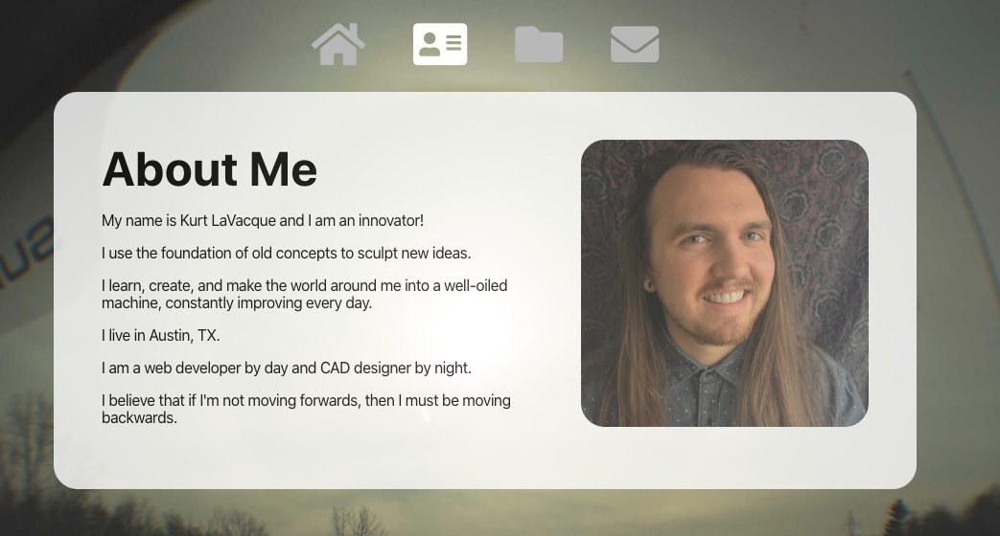

# Kurt LaVacque Portfolio

## About The Project

When creating this portfolio I wanted to showcase my skills as not only a web developer but a web designer.
I find it facinating the way we interact with technology.
I'm still learning, and this is for sure not the final version of my portfolio. I dont think there will ever be final version. But I like how it looks. Can't wait to add more features!

<!-- ## About the Developer

I'm to make things that work and -->

### Features

- Automatic Location Prompt
- Search the weather in any city in the world
- Choose from a predetermined list of major City, to get a view of what the weather is like there.

### Future Development

- Add a blog post page
- A image gallery for my projects
- Links to the github repos on projects
- Update with projects

### Built With

- React
- Node.js
- EmailJS

### UI

I used a visual reference when creating this UI, but I did not copy any code from reference. I created everything from scratch. I didnt use any css frameworks, or premade react components.

## Home Page

## About Me Page

## Projects Page

## Contact Page

